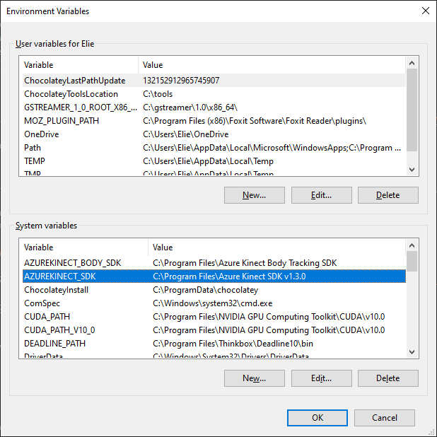
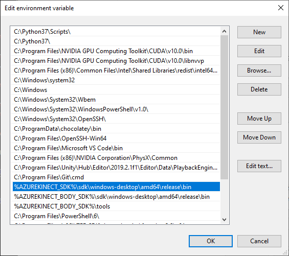

# ofxAzureKinect

ofxAddon that allows you to use [Azure Kinect](https://azure.microsoft.com/en-us/services/kinect-dk/) in [openFrameworks](https://github.com/openframeworks/openFrameworks).

* Get depth, color, depth to world, and color in depth frames as `ofPixels` or `ofTexture`.
* Get point cloud VBO with texture coordinates in depth space.
* Get body tracking skeleton and index texture.
* Use multiple sensors per machine (tested up to 4!)
* Set up sync mode (standalone, master, subordinate) with multiple devices when connected with sync cables.
* Record and playback streams.
* More coming soon...

## Installation

The instructions below are based on the [Azure Kinect Sensor SDK Usage](https://github.com/microsoft/Azure-Kinect-Sensor-SDK/blob/develop/docs/usage.md) page.

### Windows

* Install the [Azure Kinect Sensor SDK](https://docs.microsoft.com/en-us/azure/Kinect-dk/sensor-sdk-download).
* Install the [Azure Kinect Body Tracking SDK](https://docs.microsoft.com/en-us/azure/Kinect-dk/body-sdk-download).
* Add an environment variable for `AZUREKINECT_SDK` and set it to the Sensor SDK installation path (no trailing slash). The default is `C:\Program Files\Azure Kinect SDK v1.4.1`.
* Add an environment variable for `AZUREKINECT_BODY_SDK` and set it to the Body SDK installation path (no trailing slash). The default is `C:\Program Files\Azure Kinect Body Tracking SDK`.

	

* Add the path to the Sensor SDK `bin` folder to the `PATH` variable. The default is `%AZUREKINECT_SDK%\sdk\windows-desktop\amd64\release\bin`.
* Add the path to the Body SDK `bin` folder to the `PATH` variable. The default is `%AZUREKINECT_BODY_SDK%\sdk\windows-desktop\amd64\release\bin`.
* Add the path to the Body SDK `tools` folder to the `PATH` variable. The default is `%AZUREKINECT_BODY_SDK%\tools`.

	

* Clone this repository in your openFrameworks `addons` folder.
* You can then use the OF Project Generator to generate projects with the appropriate headers and libraries included. ✌️
* Note that if you want to use body tracking, you will need to copy the cuDNN model file `dnn_model_2_0.onnx` from the Body SDK `tools` folder into your project's `bin` folder!

### Linux

* Configure the [Linux Software Repository for Microsoft](https://docs.microsoft.com/en-us/windows-server/administration/linux-package-repository-for-microsoft-software). Note that for Ubuntu you'll need to set up the repo for 18.04 even if you're running newer versions.
* Install the Azure Kinect Sensor SDK packages: `libk4a1.3` `libk4a1.3-dev` `k4a-tools`
* Install the Azure Kinect Body Tracking SDK packages: `libk4abt1.0` `libk4abt1.0-dev`
* Setup udev rules by copying [this file](https://github.com/microsoft/Azure-Kinect-Sensor-SDK/blob/develop/scripts/99-k4a.rules) to `/etc/udev/rules.d/99-k4a.rules`.
* Install [libjpeg-turbo](https://sourceforge.net/projects/libjpeg-turbo/).
* Clone this repository in your openFrameworks `addons` folder.
* You can then use the OF Project Generator to generate projects with the appropriate headers and libraries included. 
🐣

## Compatibility

Tested with: 
* openFrameworks 0.10.x / 0.11.x
* Windows 10, Visual Studio 2017 / 2019
* Ubuntu 19.10, Qt Creator

## Examples

Use the OF Project Generator to create the example project files. If everything is installed correctly, it should properly locate all required include and library files.

* `example-streams` demonstrates how to get depth, color, infrared textures from the device.
* `example-scaled-depth` demonstrates how to remap the depth data to a narrower (probably more useful) range.
* `example-pointCloud` demonstrates how to draw the basic point cloud VBO from the device.
* `example-world-coord` demonstrates how to get the world coordinate from the depth and depth to world data sets.
* `example-shader` demonstrates how to reconstruct a point cloud using LUTs in a shader.
* `example-bodies` demonstrates how to get the body tracking index texture and skeleton joint information in 3D.
* `example-bodies-projected` demonstrates how to get the body tracking index texture and skeleton joint information in 2D.
* `example-multi` demonstrates how to use multiple devices in a single app.
* `example-record` demonstrates how to record and playback device streams.